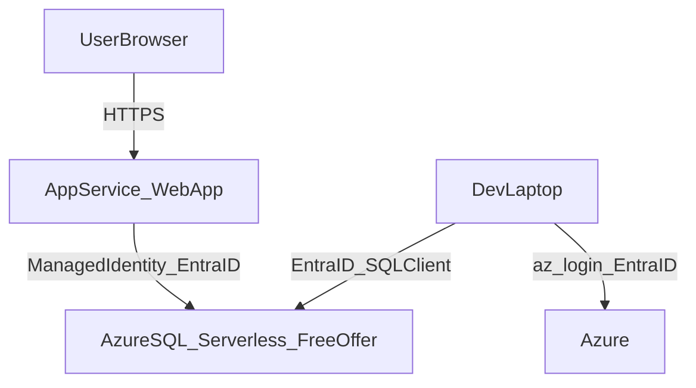
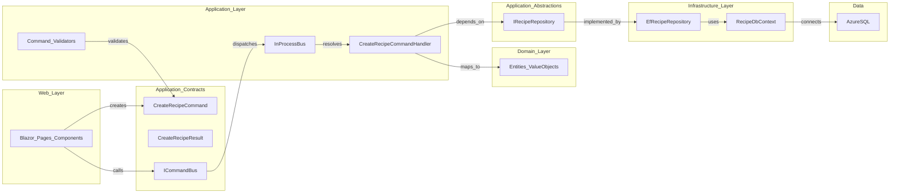

# RecipeLibrary

A personal recipe library built with **.NET** and **Blazor Server**, designed to run on Azure using **free-tier friendly** services and **password-less** authentication (Microsoft Entra ID).

## Architecture at a glance

### Azure runtime + local development connectivity

### Application architecture (Clean + CQRS/UseCases)

This repo uses a layered structure (`Domain`/`Application`/`Infrastructure`/`Web`) and exposes use cases via Commands/Handlers dispatched through an in-process command bus.

## Repository structure

- **`src/Domain`**: domain model (entities, value objects, domain events).
- **`src/Application`**:
  - **`RecipeLibrary.Application.Contracts`**: commands/results + bus interfaces (UI-facing, no infrastructure).
  - **`RecipeLibrary.Application.Abstractions`**: ports (e.g. repositories) implemented by Infrastructure.
  - **`RecipeLibrary.Application`**: handlers, validators, in-process bus implementation, and DI registration.
- **`src/Infrastructure`**: EF Core persistence, repository implementations, external services.
- **`src/Web`**: Blazor Server UI and dependency injection wiring.

## Infrastructure (Azure, Bicep)

This repo provisions a **test** environment in Azure (region: `westeurope`) using Bicep:

- **App Service Plan**: Free tier (F1)
- **Web App**: System Assigned Managed Identity enabled
- **Azure SQL**: General Purpose **serverless** database using the **Azure SQL Database Free Offer**
- **Firewall rules**: allow Azure services + optional laptop public IP for debugging

See: `infra/README.md`

## Database & migrations (EF Core)

- EF Core migrations are used for schema management (no `EnsureCreated`).
- The app is intended to apply migrations in dev/test, with the same schema moving into Azure SQL.

See: `docs/azure/test-runbook.md`

## Tailwind CSS (Web project)

The Blazor Web app uses **Tailwind CSS** for styling. Building CSS requires **Node.js** and **npm**.

- **Config**: `src/Web/RecipeLibrary.Web/tailwind.config.js` (content: `.razor`, `wwwroot`).
- **Source CSS**: `src/Web/RecipeLibrary.Web/wwwroot/css/source.css` (Tailwind directives + app custom styles). Custom Blazor styles are also kept in `wwwroot/app.custom.css` for reference; the build inlines them into the generated `app.css`.

**Commands** (run from `src/Web/RecipeLibrary.Web`):

- First time: `npm install`
- Development (watch): `npm run watch:css`
- One-off build: `npm run build:css`

Run `npm run build:css` before `dotnet build`/publish if you changed Tailwind source or content.

## Local development

**Local debug with Docker SQL** (app and DB on your machine):

- Start the SQL container: `docker compose up -d sql --wait`
- Copy `.env.example` to `.env` and set `MSSQL_SA_PASSWORD`
- Run or debug the web project; the app uses a local connection string fallback in Development

See: `docs/local-debug.md`

**Against Azure SQL (password-less)**:

- `az login`
- Set `ConnectionStrings__RecipeDb` to a password-less Azure SQL connection string (Entra auth)
- Run the web project

Full instructions: `docs/azure/test-runbook.md`

## Worktree workflow (required)

This repo uses a strict worktree workflow (agents and humans):

- Start a workstream: `scripts/start-development.ps1`
- Commit + create PR: `scripts/new-pr.ps1`
- Stop/cleanup: `scripts/stop-development.ps1`

Policy reference: `.cursor/rules/worktrees-and-branches.mdc`

## Cost guards

- This project is designed to stay **free-tier friendly**; always verify your Azure subscription’s free offerings and quotas.
- Azure SQL Free Offer is configured to **auto-pause until next month** when the free limit is exhausted.
- Set a budget/alert on the resource group/subscription to avoid surprises.

## Docs index

- `docs/local-debug.md` — local debug with Docker SQL
- `infra/README.md`
- `docs/azure/test-runbook.md`
- `docs/azure/sql-grants.sql`
