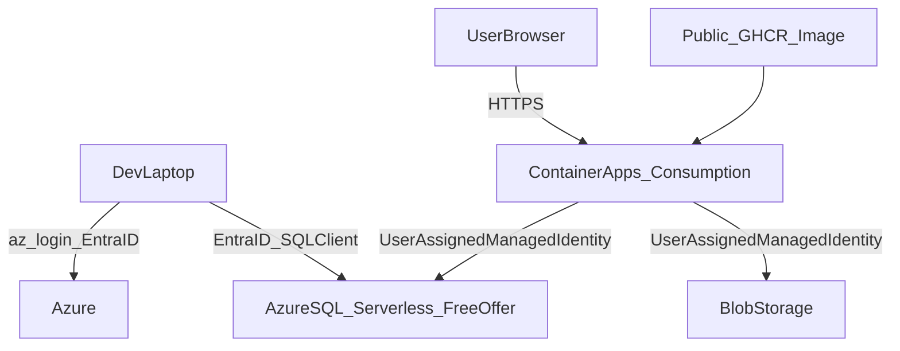
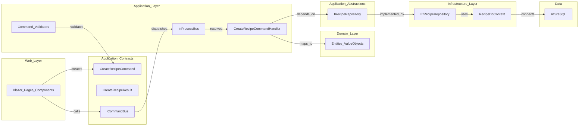

# RecipeLibrary

A personal recipe library built with **.NET** and **Blazor Server**, designed to run on Azure using **free-tier friendly** services and **password-less** authentication (Microsoft Entra ID).

## Architecture at a glance

### Azure runtime + local development connectivity


```mermaid
flowchart TD
  DevLaptop[DevLaptop] -->|az_login_EntraID| Azure[Azure]
  UserBrowser[UserBrowser] -->|HTTPS| ContainerApp[ContainerApps_Consumption]
  GHCR[Public_GHCR_Image] --> ContainerApp
  ContainerApp -->|UserAssignedManagedIdentity| AzureSQL[AzureSQL_Serverless_FreeOffer]
  ContainerApp -->|UserAssignedManagedIdentity| BlobStorage[BlobStorage]
  DevLaptop -->|EntraID_SQLClient| AzureSQL
```

### Application architecture (Clean + CQRS/UseCases)


```mermaid
flowchart LR
  subgraph WebLayer[Web_Layer]
    BlazorUI[Blazor_Pages_Components]
  end

  subgraph Contracts[Application_Contracts]
    CreateRecipeCmd[CreateRecipeCommand]
    CreateRecipeResult[CreateRecipeResult]
    CommandBus[ICommandBus]
  end

  subgraph AppLayer[Application_Layer]
    CreateRecipeHandler[CreateRecipeCommandHandler]
    Validators[Command_Validators]
    InProcBus[InProcessBus]
  end

  subgraph DomainLayer[Domain_Layer]
    DomainModel[Entities_ValueObjects]
  end

  subgraph Abstractions[Application_Abstractions]
    IRecipeRepository[IRecipeRepository]
  end

  subgraph InfraLayer[Infrastructure_Layer]
    RecipeRepo[EfRecipeRepository]
    DbCtx[RecipeDbContext]
  end

  subgraph DataLayer[Data]
    AzureSQL[AzureSQL]
  end

  BlazorUI -->|creates| CreateRecipeCmd
  BlazorUI -->|calls| CommandBus
  CommandBus -->|dispatches| InProcBus
  InProcBus -->|resolves| CreateRecipeHandler
  Validators -->|validates| CreateRecipeCmd
  CreateRecipeHandler -->|maps_to| DomainModel
  CreateRecipeHandler -->|depends_on| IRecipeRepository
  IRecipeRepository -->|implemented_by| RecipeRepo
  RecipeRepo -->|uses| DbCtx
  DbCtx -->|connects| AzureSQL
```

This repo uses a layered structure (`Domain`/`Application`/`Infrastructure`/`Web`) and exposes use cases via Commands/Handlers dispatched through an in-process command bus.

## Repository structure

- **`src/Domain`**: domain model (entities, value objects, domain events).
- **`src/Application`**:
  - **`RecipeLibrary.Application.Contracts`**: commands/results + bus interfaces (UI-facing, no infrastructure).
  - **`RecipeLibrary.Application.Abstractions`**: ports (e.g. repositories) implemented by Infrastructure.
  - **`RecipeLibrary.Application`**: handlers, validators, in-process bus implementation, and DI registration.
- **`src/Infrastructure`**: EF Core persistence, repository implementations, external services.
- **`src/Web`**: Blazor Server UI and dependency injection wiring.
- **`data/ingredients`**: curated bilingual ingredient catalog for seeding the canonical ingredient store (see `docs/ingredient-catalog.md`).

## Infrastructure (Azure, Bicep)

This repo provisions a **test** environment in Azure (region: `swedencentral`) using Bicep:

- **Container Apps Consumption**: scale-to-zero, max 1 replica, public GHCR image
- **User-assigned managed identity**: SQL and Blob access
- **Azure SQL**: General Purpose **serverless** database using the **Azure SQL Database Free Offer**
- **Cost guard**: optional `infra/cost-guard.bicep` budget + auto-stop (see `infra/README.md`)
- **Firewall rules**: allow Azure services + optional laptop public IP for debugging

See: `infra/README.md`

## Database & migrations (EF Core)

- EF Core migrations are used for schema management (no `EnsureCreated`).
- The app is intended to apply migrations in dev/test, with the same schema moving into Azure SQL.

See: `docs/azure/test-runbook.md`

## Tailwind CSS (Web project)

The Blazor Web app uses **Tailwind CSS** for styling. **No Node.js or npm** is required: the Tailwind standalone CLI is run automatically on every build (including when you start a debug session from Visual Studio).

- **NuGet**: `MarshalHayes.Tailwind.Standalone` downloads the Tailwind standalone CLI and runs it as part of `dotnet build`.
- **Config**: `src/Web/RecipeLibrary.Web/tailwind.config.js` (content: `.razor`, `wwwroot`).
- **Source CSS**: `src/Web/RecipeLibrary.Web/wwwroot/css/source.css` (Tailwind directives + app custom styles). Custom Blazor styles are also in `wwwroot/app.custom.css` for reference; they are inlined into the built `wwwroot/app.css`.

When you build or run the web project (e.g. F5 in Visual Studio), Tailwind runs first and then the app.

## Local development

**Local debug with Docker SQL** (app and DB on your machine):

- Start the SQL container: `docker compose up -d sql --wait`
- Copy `.env.example` to `.env` and set `MSSQL_SA_PASSWORD`
- Run or debug the web project; the app uses a local connection string fallback in Development

See: `docs/local-debug.md`. Voor verbinden met een SQL-client (SSMS, Azure Data Studio, enz.) en tooling: `docs/database-connection.md`.

**One-command local start** (after `./scripts/install-cli.ps1`):

```powershell
rlstart
```

**Against Azure SQL (password-less)**:

- `az login`
- Set `ConnectionStrings__RecipeDb` to a password-less Azure SQL connection string (Entra auth)
- Run the web project

Full instructions: `docs/azure/test-runbook.md`

## Worktree workflow (required)

This repo uses a strict worktree workflow (agents and humans):

- Start a workstream: `scripts/start-development.ps1`
- Commit + create PR: `scripts/new-pr.ps1`
- Stop/cleanup: `scripts/stop-development.ps1`

Policy reference: `.cursor/rules/worktrees-and-branches.mdc`

## Cost guards

- This project is designed to stay **free-tier friendly**; always verify your Azure subscription’s free offerings and quotas.
- Azure SQL Free Offer is configured to **auto-pause until next month** when the free limit is exhausted.
- Container Apps Consumption scales to **zero** when idle (`minReplicas: 0`).
- Deploy `infra/cost-guard.bicep` for a €5 monthly budget with automatic stop at 80% actual spend.
- Use `azure-pipelines-control.yml` for manual stop/start/status (`start` uses environment `test`).

## Azure DevOps (boards & CI)

Code staat op **GitHub**; backlog en pipelines in **Azure DevOps**. Geen aparte
repo-sync nodig. Zie `docs/azure/ado-github-integration.md`.

## Docs index

- `docs/ingredient-catalog.md` — curated ingredient catalog (sources, generation, language keys, seed intent)
- `docs/azure/ado-github-integration.md` — GitHub + Azure DevOps workflow
- `docs/azure/subscription-bootstrap.md` — subscription, providers, service connection RBAC
- `docs/local-debug.md` — local debug with Docker SQL
- `docs/database-connection.md` — verbinden met de lokale Docker-database en tooling (SSMS, Azure Data Studio, VS Code)
- `infra/README.md`
- `docs/azure/test-runbook.md`
- `docs/azure/sql-grants.sql`
